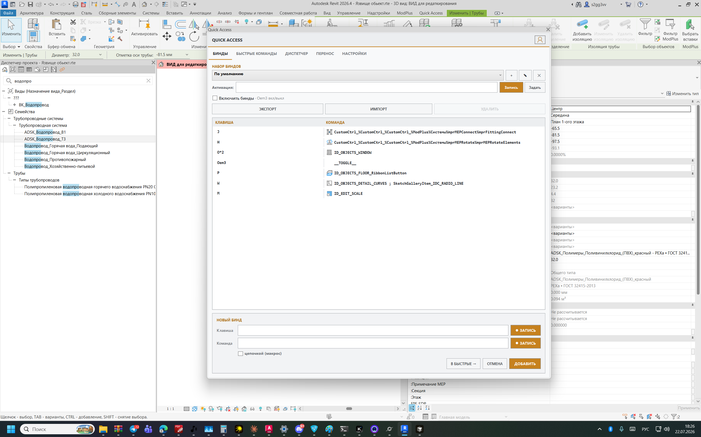
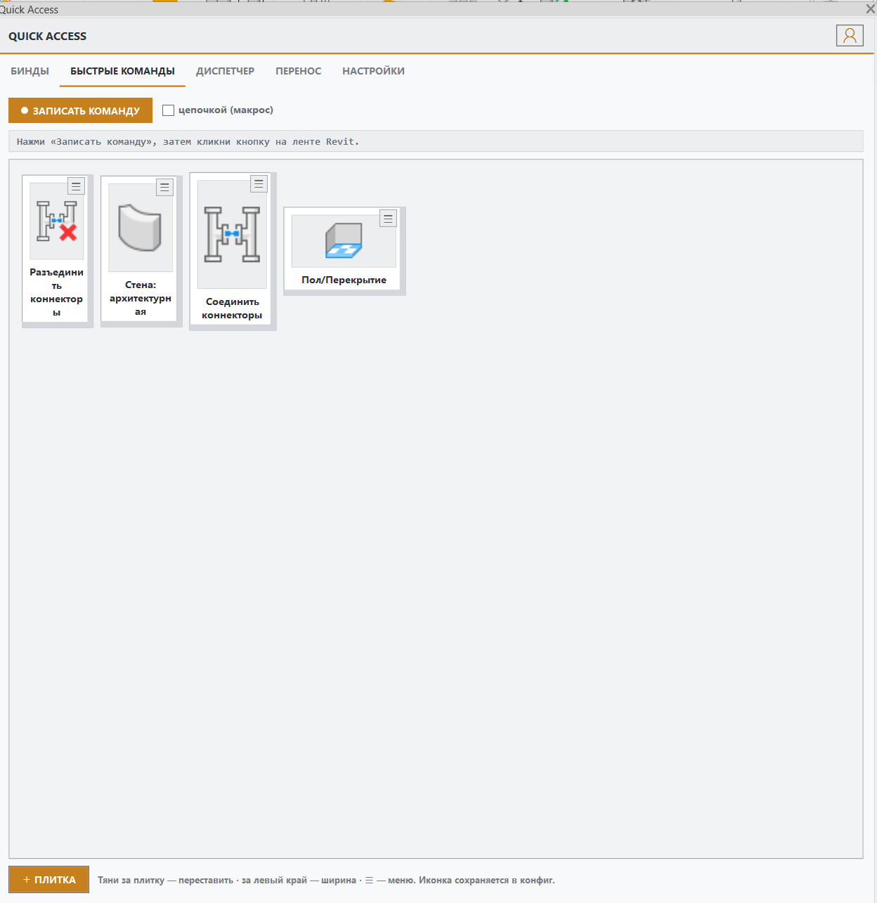
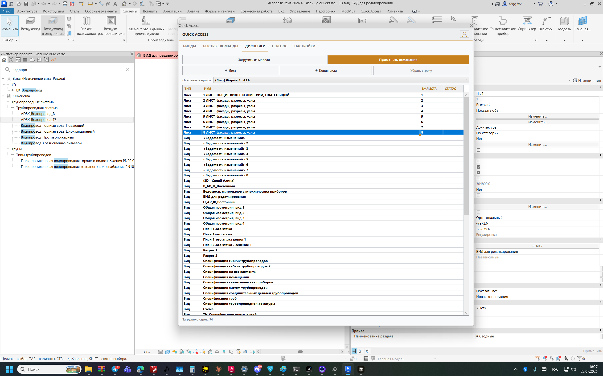
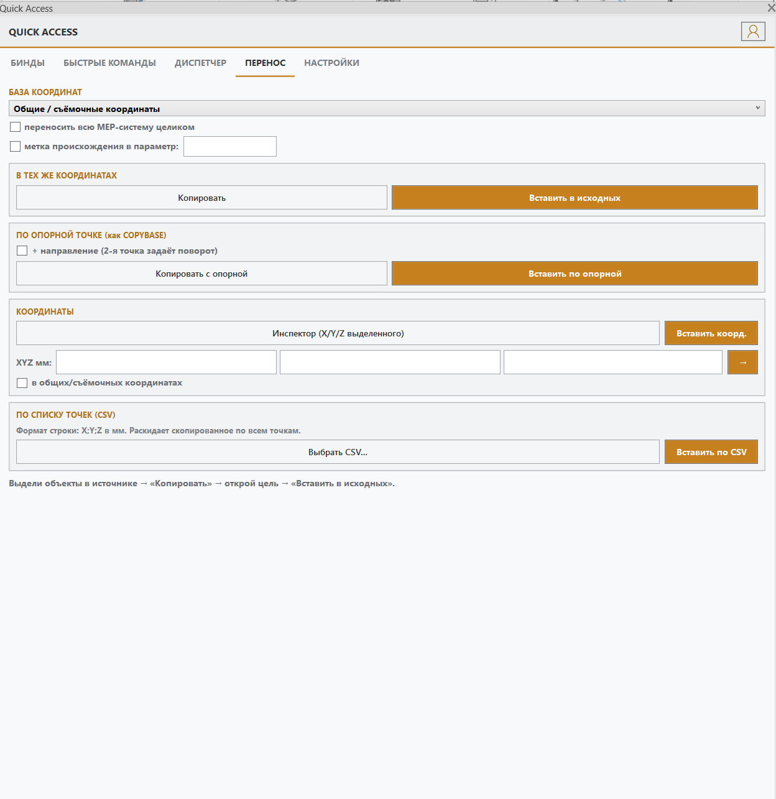
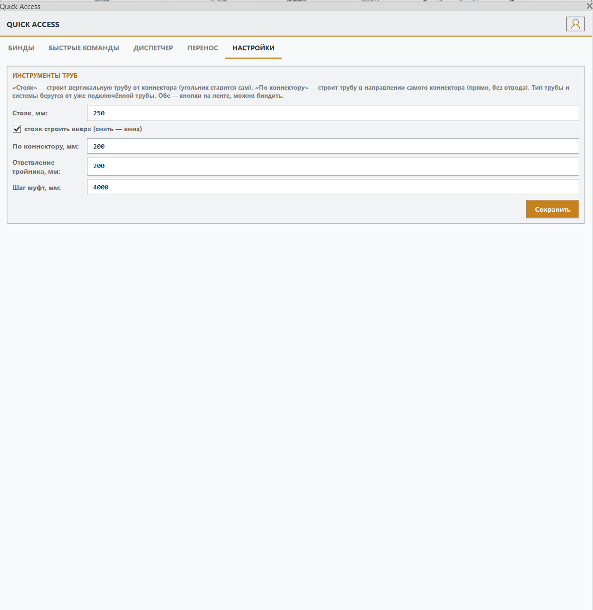

# Revit Quick Access

**Vibecoding project. Plugin for Revit. MEP and more.**

Плагин для **Autodesk Revit 2026** — бинды клавиш, быстрые команды-плитки, пакетный диспетчер проекта, точный перенос объектов между проектами и набор MEP-инструментов.

Открытый исходный код. Собирается обычным `dotnet build`, Visual Studio не нужна.

## Как выглядит

Новый PNG в `docs/screenshots` подхватывается сам: он попадает и в слайд-шоу установщика,
и сюда — надо лишь дописать строку ниже. Порядок показа — по имени файла.

**Бинды** — наборы, мультитап, аккорды, макросы; срабатывают только в рабочей области модели.


**Быстрые команды** — плитки с иконками прямо с ленты Revit, перетаскивание и изменение размера.


**Диспетчер проекта** — виды и листы таблицей, правки копятся и применяются одной транзакцией.


**Перенос** — копирование между проектами в тех же координатах, опорная точка, CSV, MEP-системы.


**Настройки** — параметры MEP-инструментов, версия и состояние авто-обновления.


## Возможности

### Бинды
- Наборы (профили) биндов с переключением по горячей клавише
- Форматы: `E`, `Ctrl+E`, `E*2` (мультитап), `A+S` (аккорд), `__TOGGLE__`
- Команда = внутренний id Revit, записанный клик по ленте, макрос из нескольких шагов
  или встроенное действие
- Встроенное действие **`__MOVE:dx,dy,dz__`** — сдвиг выделенного на точное число миллиметров
  по осям модели. Штатные стрелки Revit двигают на величину, зависящую от масштаба экрана,
  а это — ровно на заданное. Каждое нажатие = отдельный шаг отмены.
  Например `Shift+Up` → `__MOVE:0,20,0__`, `Shift+Down` → `__MOVE:0,-20,0__`
- Запись клавиши и команды прямо в панели; макросы записываются цепочкой
- Бинды срабатывают **только в рабочей области модели** — при вводе текста они молчат

### Быстрые команды
- Плитки с иконками команд (иконка берётся с ленты Revit)
- Перетаскивание, изменение размера, меню на плитке
- Клик = выполнить; можно перекинуть команду в бинд с назначением клавиши

### Диспетчер проекта (пакетный)
- Таблица видов и листов: переименование, нумерация, создание, удаление
- Все правки применяются **одной транзакцией** по кнопке «Применить»
- Двухфазное применение — перенумерация со сдвигом не ломается о `Sheet number is already in use`
- **Автонумерация листов**: галочка → номера 1…N по порядку строк, строки можно **перетаскивать мышью**,
  номера пересчитываются сами (так меняются местами и соседние листы)
- Excel-маркер автозаполнения (потянуть вниз → автонумерация)
- Естественная сортировка (1, 1.2, 2, 10 — а не 1, 10, 2), листы всегда первыми
- **Дублирование видов и листов** по правой кнопке — выполняется сразу, результат виден мгновенно
- У выбранного листа показывается его **реальный штамп**; отдельно выбирается штамп для новых листов

### Перенос
- Копирование/вставка объектов **в тех же координатах между проектами** (общие/съёмочные или внутренние)
- Копирование с опорной точкой (как COPYBASE) с поворотом
- Инспектор координат, перемещение в точные X/Y/Z, вставка по списку точек из CSV
- Перенос MEP-систем целиком, метка происхождения

### MEP-инструменты
- **Стояк** — вертикальная труба фиксированной длины от коннектора
- **По коннектору** — труба в направлении самого коннектора
- **Автотройник** — врезка тройника с ответвлением (4 направления + 45°)
- **Автомуфты** — нарезка труб на сегменты с муфтами из настроек трассировки
- **Гибкая труба** — соединение двух коннекторов
- **Обрезка** — обрезка линий по пересечениям, как TRIM в AutoCAD

Тип трубопровода, система и диаметр определяются по уже подключённой трубе (обход сети через фитинги).

### Работа с типами (то, что раньше делалось скриптами Dynamo)

- **Тип системы** — смена типа системы у выделенного. У подключённого крана или арматуры параметр
  «Тип системы» расчётный: он читается из MEP-системы, поэтому запись в сам элемент ничего не даёт.
  Инструмент меняет тип **у самой MEP-системы**, и только потом — у отдельных труб через `SetSystemType`.
  Пять подходов: вся подключённая сеть (рекомендуется), только выделенные трубы, напрямую,
  весь проект, диагностика без изменений. Есть откат, если выделенное так и не получило нужный тип.
- **Материал трубы** — смена материала типа трубопровода через сегмент. Материал сегмента в Revit
  только читается, поэтому создаётся новый сегмент «выбранный материал + Schedule/Type и типоразмеры
  сегмента-источника» и подставляется в настройки трассировки. Уже нарисованные трубы этого типа
  переводятся на новый сегмент отдельно — сами они за трассировкой не следуют.
- **Гибкий тип** — создание типа гибкого трубопровода по образцу обычного (имя + `_Гибкий`).
  `PipeType` и `FlexPipeType` — разные классы, напрямую не дублируются: снимается копия с
  существующего гибкого типа, затем копируются все одноимённые записываемые параметры, материал
  (из параметра типа, иначе из первого сегмента) и первый диаметр.

## Сборка

```powershell
.\build.ps1            # плагин + установщик, с авто-коммитом
.\build.ps1 -NoCommit  # без коммита
```

Требуется .NET 8 SDK и установленный Revit 2026 (ссылки на `RevitAPI.dll` берутся из
`C:\Program Files\Autodesk\Revit 2026`).

## Установка

Запустить `RevitQuickAccess-Setup.exe` (из Releases или собрать скриптом выше).
Закрывать Revit не требуется — при первой установке файлы просто копируются, при переустановке
занятая библиотека переименовывается, и новая версия подхватывается при следующем запуске Revit.

Плагин ставится в `%APPDATA%\Autodesk\Revit\Addins\2026`.

## Версионирование

`MAJOR.FEATURE.FIX`

| Цифра | Когда растёт |
|---|---|
| вторая | появилась новая функция |
| третья | пакет исправлений багов |

```powershell
.\release.ps1 -Fix       # 1.2.3 -> 1.2.4
.\release.ps1 -Feature   # 1.2.3 -> 1.3.0
```

Скрипт поднимает версию, собирает, коммитит, ставит тег и публикует релиз на GitHub.

CI на GitHub Actions намеренно не используется — сборка требует `RevitAPI.dll`, которых нет
в открытом доступе, поэтому релизы собираются локально.

## Авто-обновление

При каждом запуске Revit плагин **в фоне** проверяет GitHub Releases. Если вышла версия новее:

1. она молча скачивается (Revit при этом не тормозится);
2. в правом нижнем углу на 3 секунды всплывает уведомление о новой версии;
3. подмена файла происходит **при закрытии Revit** — в работающей сессии файлы не трогаются;
4. следующий запуск Revit уже на новой версии.

Токены не нужны: репозиторий публичный, проверка — обычный GET к GitHub API.
Отключается в `RevitQuickAccess_settings.txt`: `autoUpdate=0`.

Текущая версия и состояние обновления видны во вкладке **«Настройки»** панели.

## Публикация своего конфига

Наборы биндов, плитки быстрых команд и настройки инструментов можно выложить как пресет:

```powershell
cd tools
.\publish-config.ps1              # -> presets/default
.\publish-config.ps1 -Name mep-vk # -> presets/mep-vk
```

Скрипт забирает живые конфиги из папки Revit Addins, чистит из них личный URL приёмника отчётов
(и падает, если вычистить не удалось — чтобы секрет не уехал в публичный репозиторий)
и складывает в `presets/<имя>/` — останется закоммитить. Чтобы применить пресет, скопируй файлы
обратно в `%APPDATA%\Autodesk\Revit\Addins\2026`.

Опубликованный пресет автора — [`presets/default`](presets/default).

## Отчёты об ошибках

Кнопка «человечек» в панели открывает окно отчёта; сбои Revit фиксируются автоматически
(в том числе нативные — через маркер сессии) и уходят при следующем запуске.

Отчёты отправляются на **свой релей** — Cloudflare Worker, исходник в
[`tools/report-worker.js`](tools/report-worker.js). Плагин знает только публичный URL, а секрет
(токен Telegram, вебхук Discord) хранится в переменных воркера и в репозиторий не попадает.

Развернуть релей:

```powershell
cd tools
.\deploy-worker.ps1
```

Затем прописать полученный URL в `RevitQuickAccess_settings.txt`:

```
reportEndpoint=https://rqa-report.<логин>.workers.dev
```

Если эндпоинт не задан, отчёт просто сохраняется в папку `reports` и копируется в буфер обмена.

## Структура

| Папка | Назначение |
|---|---|
| `Binds/` | движок биндов: перехват клавиш, наборы, исполнение команд |
| `Quick/` | быстрые команды, запись кликов по ленте, иконки |
| `Browser/` | пакетный диспетчер проекта |
| `Transfer/` | точный перенос между проектами |
| `Commands/` | MEP-инструменты и обрезка |
| `Update/` | авто-обновление с GitHub Releases |
| `Report/` | отчёты об ошибках и перехват сбоев |
| `UI/` | панель и окна (WPF) |
| `Installer/` | отдельный проект установщика |
| `tools/` | Cloudflare Worker для отчётов, публикация пресетов |
| `docs/screenshots/` | превью для README и слайд-шоу установщика |

## Лицензия

MIT — см. [LICENSE](LICENSE).
